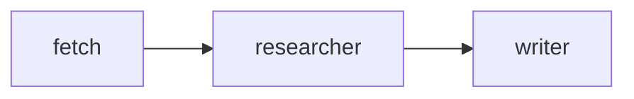
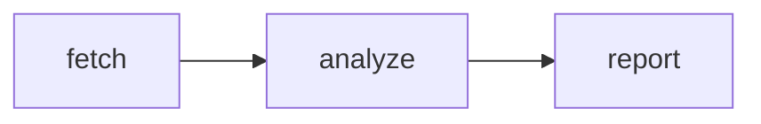
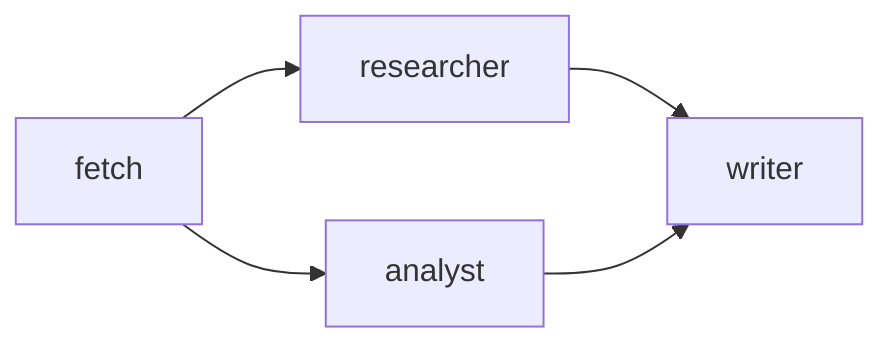
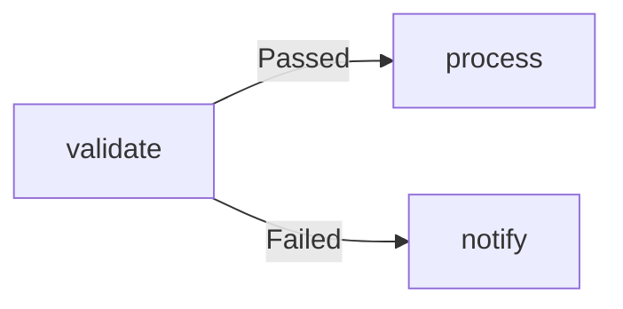

# vessy

**Agentic pipeline orchestrator.** Define multi-step AI workflows as Mermaid flowcharts, run them from Claude Code with a single skill invocation, and collect full artifacts and reports for every run.

---

## Table of contents

1. [Concepts](#concepts)
2. [Project structure](#project-structure)
3. [Agents](#agents)
   - [LLM agent](#llm-agent)
   - [Script agent](#script-agent)
   - [Composite agent](#composite-agent)
   - [Optional fields](#optional-fields)
4. [Pipelines](#pipelines)
   - [File format](#file-format)
   - [Sequential pipeline](#sequential-pipeline)
   - [Parallel pipeline](#parallel-pipeline)
   - [Conditional edges](#conditional-edges)
5. [Claude Code integration](#claude-code-integration)
   - [Installing the plugin](#installing-the-plugin)
   - [Agent commands](#agent-commands)
   - [Pipeline commands](#pipeline-commands)
6. [Run sessions and artifacts](#run-sessions-and-artifacts)
7. [Package architecture](#package-architecture)

---

## Concepts

| Concept | Description |
|---|---|
| **Agent** | A single unit of work — an LLM call, a shell script, or a sequence of both. Defined as a YAML file. |
| **Pipeline** | A directed graph of agents, described as a Mermaid `flowchart LR` diagram inside a Markdown file. |
| **Session** | A single run of a pipeline. Artifacts, manifests, and the final report are saved to `.vessy/sessions/<session-id>/`. |
| **Artifact** | Any file written by an agent during its run. Each agent gets an isolated subdirectory inside the session. |

vessy resolves the execution order from the graph, runs independent agents in parallel, passes predecessor outputs to downstream agents via environment variables, and writes a structured report at the end.

---

## Project structure

Create a `.vessy/` directory at the root of your project:

```
your-project/
└── .vessy/
    ├── agents/          # One YAML file per agent
    │   ├── fetch.yaml
    │   ├── researcher.yaml
    │   └── writer.yaml
    ├── pipelines/       # One Markdown file per pipeline
    │   └── research.md
    └── sessions/        # Created automatically on first run
        └── session-a3f7bc92/
            ├── pipeline-run.json
            ├── 1-fetch/
            │   ├── manifest.json
            │   └── data.txt
            └── 2-researcher/
                ├── manifest.json
                └── response.md
```

---

## Agents

An agent is a YAML file inside `.vessy/agents/`. The filename (without `.yaml`) is the agent's name, which is also the node identifier used in pipeline diagrams.

### LLM agent

Calls the Anthropic API with the given model and system prompt.

```yaml
name: researcher
type: llm
model: claude-opus-4-7
system_prompt: |
  You are a research assistant. Given a topic, produce a concise summary
  of the key facts. Write your output in markdown format.
```

The agent receives predecessor outputs via environment variables:

| Variable | Value |
|---|---|
| `VESSY_SESSION_DIR` | Absolute path to the session directory |
| `VESSY_OUTPUT_DIR` | Absolute path to this agent's output directory |
| `VESSY_INPUT_<PREDECESSOR>` | Absolute path to `<predecessor>` agent's output directory |

The LLM response is saved automatically to `response.md` in the agent's output directory.

### Script agent

Runs a shell script (or any executable). The script must write a `manifest.json` to its working directory (`VESSY_OUTPUT_DIR`) before exiting.

```yaml
name: fetch
type: script
script: ./scripts/fetch.sh
args: []
```

**`manifest.json` format:**

```json
{
  "status": "Passed",
  "outputs": ["data.txt", "metadata.json"]
}
```

`status` can be `Passed`, `Failed`, or any custom string (see [Conditional edges](#conditional-edges)).

**Example script:**

```bash
#!/bin/sh
curl -s "https://api.example.com/data" > data.txt
echo '{"status":"Passed","outputs":["data.txt"]}' > manifest.json
```

The same environment variables listed above (`VESSY_SESSION_DIR`, `VESSY_OUTPUT_DIR`, `VESSY_INPUT_*`) are available to the script.

### Composite agent

A sequence of steps executed in order within a single agent. Each step is either an LLM call or a script.

```yaml
name: analyze-and-summarize
type: composite
steps:
  - type: llm
    model: claude-haiku-4-5-20251001
    system_prompt: |
      Analyze the provided data and extract key metrics.
  - type: script
    script: ./scripts/format-report.sh
```

### Optional fields

All agent types support:

| Field | Type | Description |
|---|---|---|
| `timeout` | `number` (seconds) | Kill the agent if it runs longer than this. |
| `statuses` | `string[]` | Custom status strings the agent may emit (used with conditional edges). |

---

## Pipelines

A pipeline is a Markdown file inside `.vessy/pipelines/`. It combines a YAML frontmatter block with a Mermaid `flowchart LR` diagram.

### File format

```markdown
---
name: research
description: Fetch, analyze, and write a research report
---


```

The `name` field is required. `description` is optional and is shown in `/vessy:pipeline-list`.

### Sequential pipeline

Agents run one after another. Each agent receives the previous agent's output directory as `VESSY_INPUT_<PREDECESSOR>`.



### Parallel pipeline

Agents with no dependency between them run concurrently. vessy waits for all branches to complete before running downstream nodes.



Here `researcher` and `analyst` run in parallel after `fetch` completes. `writer` starts only when both finish.

### Conditional edges

Use labeled edges to route execution based on an agent's status.



The label must match the `status` string returned in the agent's `manifest.json`. When a conditional edge is not taken, the downstream node (and any transitive dependents) are skipped automatically.

You can define custom statuses:

```yaml
name: validate
type: script
script: ./scripts/validate.sh
statuses: [Passed, Failed, NeedsReview]
```

---

## Claude Code integration

vessy ships as a Claude Code plugin (`@vessy/adapter-claude-code`). Once installed, you get eleven slash commands that let Claude run and fully manage your agents and pipelines without leaving the chat.

### Installing the plugin

**Step 1 — Build the CLI bundle:**

```bash
cd /path/to/vessy
pnpm install
pnpm --filter @vessy/adapter-claude-code build
```

This produces `packages/adapter-claude-code/dist/cli.cjs`, a self-contained bundle that includes `@vessy/core` and all dependencies.

**Step 2 — Register the plugin with Claude Code:**

```bash
ln -sf /path/to/vessy/packages/adapter-claude-code ~/.claude/skills/vessy
```

Install once, use in any project that has a `.vessy/` directory. The `/vessy:*` slash commands become available immediately in your Claude Code session.

---

### Agent commands

#### `/vessy:agent-list`

Lists all agents defined in `.vessy/agents/`.

```
researcher    llm     claude-opus-4-7
analyst       llm     claude-haiku-4-5-20251001
fetch         script
```

---

#### `/vessy:agent-get <name>`

Displays the raw YAML definition of a single agent.

```
/vessy:agent-get researcher
```

---

#### `/vessy:agent-create`

Creates a new agent interactively. Claude asks for the name, type, and type-specific fields, then writes the YAML file directly to `.vessy/agents/<name>.yaml`.

**Claude will ask:**

1. Agent name (lowercase letters, digits, and hyphens only)
2. Type: `llm`, `script`, or `composite`
3. For `llm`: model name and system prompt
4. For `script`: path to the script and optional arguments
5. For `composite`: steps (repeat for each step)

No CLI command — Claude writes the file for you via the Write tool.

---

#### `/vessy:agent-update <name>`

Updates an existing agent interactively. Claude shows the current definition, asks what you want to change, and rewrites the file — touching only the fields you mention.

```
/vessy:agent-update researcher
```

---

#### `/vessy:agent-delete <name>`

Deletes an agent after showing a preview and asking for confirmation. Type `yes` to confirm.

```
/vessy:agent-delete researcher
```

---

### Pipeline commands

#### `/vessy:pipeline-list`

Lists all pipelines with their names and descriptions.

```
research              Fetch, analyze, and write a research report
etl
```

---

#### `/vessy:pipeline-get <name>`

Shows the Mermaid diagram for a pipeline and describes its flow in one sentence.

```
/vessy:pipeline-get research
```

---

#### `/vessy:pipeline-create`

Creates a new pipeline interactively. Claude asks for a name and optional description, helps you define the flow (nodes and edges), and writes the Markdown file to `.vessy/pipelines/<name>.md`.

---

#### `/vessy:pipeline-update <name>`

Updates an existing pipeline interactively. Claude shows the current file, asks what you want to change (description, nodes, edges), and rewrites the file.

```
/vessy:pipeline-update research
```

---

#### `/vessy:pipeline-delete <name>`

Deletes a pipeline after showing a preview and asking for confirmation. Type `yes` to confirm.

```
/vessy:pipeline-delete research
```

---

#### `/vessy:pipeline-run <name>`

Runs a pipeline by name and streams the output in real time.

```
/vessy:pipeline-run research
```

**Output format:**

```
▶  fetch          session-a3f7bc92 / 1-fetch
✓  fetch          Passed     4.2s
▶  researcher     session-a3f7bc92 / 2-researcher
▶  analyst        session-a3f7bc92 / 3-analyst
✓  researcher     Passed     8.1s  1540 tok  $0.012
✓  analyst        Passed     7.4s  2100 tok  $0.018
▶  writer         session-a3f7bc92 / 4-writer
✓  writer         Passed     6.0s  1800 tok  $0.015
─────────────────────────────────────────────────────
Pipeline        Passed   25.7s  $0.045
Session         .vessy/sessions/session-a3f7bc92
```

| Prefix | Meaning |
|---|---|
| `▶` | Agent started |
| `✓` | Agent completed with `Passed` status |
| `✗` | Agent failed or errored |

**Exit codes:**

- `0` — pipeline ran (even if status is `Failed` — that is a business outcome, not an error)
- `1` — technical error: pipeline file not found, agent file missing, YAML parse error

---

## Run sessions and artifacts

Every pipeline run creates a session directory under `.vessy/sessions/`:

```
.vessy/sessions/session-a3f7bc92/
├── pipeline-run.json          # Full run report
├── 1-fetch/
│   ├── manifest.json          # Status + output list
│   └── data.txt               # Artifact written by the agent
├── 2-researcher/
│   ├── manifest.json
│   └── response.md            # LLM response (auto-saved)
└── 3-writer/
    ├── manifest.json
    └── report.md
```

**`pipeline-run.json`** contains:

```json
{
  "pipeline": "research",
  "sessionId": "session-a3f7bc92",
  "startedAt": "2026-06-25T10:00:00.000Z",
  "completedAt": "2026-06-25T10:00:25.700Z",
  "status": "Passed",
  "agents": {
    "fetch":      { "folder": "1-fetch",      "status": "Passed" },
    "researcher": { "folder": "2-researcher", "status": "Passed" },
    "writer":     { "folder": "3-writer",     "status": "Passed" }
  },
  "report": {
    "totalDurationMs": 25700,
    "status": "Passed",
    "tokens": { "input": 3200, "output": 5440, "total": 8640, "costUsd": 0.045 },
    "agentSummary": [ ... ]
  }
}
```

Sessions are append-only — each run creates a new directory. Old sessions are never deleted automatically.

---

## Package architecture

vessy is a TypeScript monorepo (pnpm workspaces + Turbo):

| Package | Description |
|---|---|
| `@vessy/sdk` | Shared TypeScript interfaces (`AgentDefinition`, `RunEvent`, `PipelineReport`, …). No runtime code. |
| `@vessy/core` | Execution engine. Exports `runPipeline(name, opts?)` — an async generator that yields `RunEvent` values. |
| `@vessy/adapter-claude-code` | Claude Code plugin. Bundles `@vessy/core` into `dist/cli.cjs` via esbuild. Ships with `.claude-plugin/plugin.json` and eleven `commands/*.md` files that register the `/vessy:*` slash commands. |

**`runPipeline` usage (TypeScript):**

```typescript
import { runPipeline } from '@vessy/core'

for await (const event of runPipeline('research')) {
  if (event.type === 'agent:start')    console.log(`Starting ${event.agent}`)
  if (event.type === 'agent:complete') console.log(`Done: ${event.status}`)
  if (event.type === 'pipeline:done')  console.log(`Report:`, event.report)
}
```

`RunOptions` lets you override the default directory paths:

```typescript
runPipeline('research', {
  agentsDir:    '/custom/.vessy/agents',
  pipelinesDir: '/custom/.vessy/pipelines',
  sessionsDir:  '/custom/.vessy/sessions',
})
```
