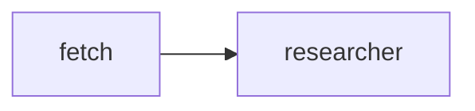
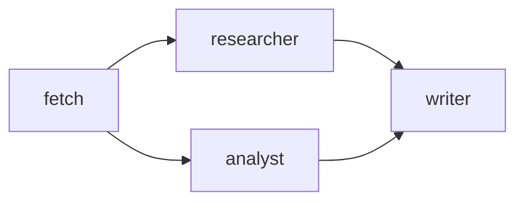

# Vessy Claude Code Adapter Implementation Plan

> **For agentic workers:** REQUIRED SUB-SKILL: Use superpowers:subagent-driven-development (recommended) or superpowers:executing-plans to implement this plan task-by-task. Steps use checkbox (`- [ ]`) syntax for tracking.

**Goal:** Build `@vessy/adapter-claude-code` — a Claude Code plugin that wraps `@vessy/core` in a bundled, self-contained CLI and skill markdown files.

**Architecture:** A single esbuild bundle (`dist/cli.js`) includes `@vessy/core` and all dependencies. Four skill markdown files guide Claude Code's behavior. No project-level installation — install the plugin once and use it anywhere with a `.vessy/` directory.

**Tech Stack:** TypeScript 5.x (ESM/NodeNext), esbuild (CJS bundle), Vitest, `tsx` (build runner), `@vessy/core` (workspace dependency).

---

## File Map

```
packages/adapter-claude-code/
├── package.json
├── tsconfig.json
├── vitest.config.ts
├── build.ts
├── plugin.json
├── src/
│   ├── cli.ts
│   ├── format.ts
│   └── commands/
│       ├── agents.ts
│       ├── pipelines.ts
│       ├── diagram.ts
│       └── run.ts
├── src/__tests__/
│   ├── format.test.ts
│   ├── agents.test.ts
│   ├── pipelines.test.ts
│   ├── diagram.test.ts
│   └── run.test.ts
└── skills/
    ├── vessy-agents.md
    ├── vessy-run-pipeline.md
    ├── vessy-add-agent.md
    └── vessy-agent-pipelines.md
```

---

## Task 1: Package Scaffold

**Files:**
- Create: `packages/adapter-claude-code/package.json`
- Create: `packages/adapter-claude-code/tsconfig.json`
- Create: `packages/adapter-claude-code/vitest.config.ts`

- [ ] **Step 1: Create package directory**

```bash
mkdir -p packages/adapter-claude-code/src/commands
mkdir -p packages/adapter-claude-code/src/__tests__
mkdir -p packages/adapter-claude-code/skills
```

- [ ] **Step 2: Write `package.json`**

```json
{
  "name": "@vessy/adapter-claude-code",
  "version": "0.0.1",
  "private": true,
  "type": "module",
  "scripts": {
    "build": "tsx build.ts",
    "test": "vitest run",
    "test:watch": "vitest",
    "typecheck": "tsc --noEmit"
  },
  "dependencies": {
    "@vessy/core": "workspace:*",
    "@vessy/sdk": "workspace:*"
  },
  "devDependencies": {
    "@types/node": "^22.0.0",
    "esbuild": "^0.25.0",
    "tsx": "^4.19.0",
    "typescript": "*",
    "vitest": "^3.0.0"
  }
}
```

- [ ] **Step 3: Write `tsconfig.json`**

```json
{
  "extends": "../../tsconfig.base.json",
  "compilerOptions": {
    "rootDir": "src",
    "outDir": "dist"
  },
  "include": ["src/**/*", "build.ts"]
}
```

- [ ] **Step 4: Write `vitest.config.ts`**

```typescript
import { defineConfig } from 'vitest/config'

export default defineConfig({
  test: {
    environment: 'node',
  },
})
```

- [ ] **Step 5: Install dependencies**

```bash
cd packages/adapter-claude-code && pnpm install
```

Expected: `node_modules` created, `esbuild`, `tsx`, `vitest` installed.

- [ ] **Step 6: Verify TypeScript resolves `@vessy/core`**

```bash
cd packages/adapter-claude-code && pnpm exec tsc --noEmit 2>&1 | head -5
```

Expected: No output (no files to check yet) or only "No inputs were found" warning — not module resolution errors.

- [ ] **Step 7: Commit**

```bash
git add packages/adapter-claude-code/package.json packages/adapter-claude-code/tsconfig.json packages/adapter-claude-code/vitest.config.ts
git commit -m "feat(adapter-claude-code): scaffold package"
```

---

## Task 2: `src/format.ts`

**Files:**
- Create: `packages/adapter-claude-code/src/format.ts`
- Create: `packages/adapter-claude-code/src/__tests__/format.test.ts`

The `format.ts` module maps `RunEvent` values to human-readable text lines. No I/O — pure functions.

Output prefix conventions:
- `▶` — agent starting
- `✓` — agent completed successfully
- `✗` — agent completed with non-Passed status, or errored
- Empty string — `pipeline:done` (handled separately by `formatDone`)

- [ ] **Step 1: Write failing tests**

`packages/adapter-claude-code/src/__tests__/format.test.ts`:

```typescript
import { describe, it, expect } from 'vitest'
import type { RunEvent, PipelineReport, AgentReport } from '@vessy/sdk'
import { formatEvent, formatDone } from '../format.js'

const baseReport: AgentReport = {
  agent: 'fetch',
  durationMs: 4200,
  invokedBy: null,
  invoked: [],
  tokens: null,
}

describe('formatEvent', () => {
  it('formats agent:start', () => {
    const event: RunEvent = {
      type: 'agent:start',
      agent: 'fetch',
      folder: '1-fetch',
      session: 'session-abc123',
    }
    expect(formatEvent(event)).toBe('▶  fetch          session-abc123 / 1-fetch')
  })

  it('formats agent:complete Passed without tokens', () => {
    const event: RunEvent = {
      type: 'agent:complete',
      agent: 'fetch',
      status: 'Passed',
      artifacts: [],
      report: { ...baseReport, agent: 'fetch', durationMs: 4200 },
    }
    expect(formatEvent(event)).toBe('✓  fetch          Passed     4.2s')
  })

  it('formats agent:complete Passed with tokens', () => {
    const event: RunEvent = {
      type: 'agent:complete',
      agent: 'researcher',
      status: 'Passed',
      artifacts: [],
      report: {
        agent: 'researcher',
        durationMs: 8100,
        invokedBy: null,
        invoked: [],
        tokens: { input: 1000, output: 540, total: 1540, costUsd: 0.012 },
      },
    }
    expect(formatEvent(event)).toBe('✓  researcher     Passed     8.1s  1540 tok  $0.012')
  })

  it('formats agent:complete with non-Passed status', () => {
    const event: RunEvent = {
      type: 'agent:complete',
      agent: 'writer',
      status: 'NeedsRevision',
      artifacts: [],
      report: { ...baseReport, agent: 'writer', durationMs: 3200 },
    }
    expect(formatEvent(event)).toBe('✗  writer         NeedsRevision 3.2s')
  })

  it('formats agent:error', () => {
    const event: RunEvent = {
      type: 'agent:error',
      agent: 'writer',
      error: 'Error: Script exited with code 1',
    }
    expect(formatEvent(event)).toBe('✗  writer         Error: Script exited with code 1')
  })

  it('returns empty string for pipeline:done', () => {
    const report: PipelineReport = {
      totalDurationMs: 32000,
      status: 'Passed',
      tokens: { input: 0, output: 0, total: 0, costUsd: 0 },
      agentSummary: [],
    }
    const event: RunEvent = {
      type: 'pipeline:done',
      sessionDir: '.vessy/sessions/abc',
      report,
    }
    expect(formatEvent(event)).toBe('')
  })
})

describe('formatDone', () => {
  it('formats pipeline summary without cost', () => {
    const report: PipelineReport = {
      totalDurationMs: 32000,
      status: 'Failed',
      tokens: { input: 0, output: 0, total: 0, costUsd: 0 },
      agentSummary: [],
    }
    const result = formatDone(report, '.vessy/sessions/session-a3f7bc92')
    const lines = result.split('\n')
    expect(lines[0]).toMatch(/^─+$/)
    expect(lines[1]).toContain('Pipeline')
    expect(lines[1]).toContain('Failed')
    expect(lines[1]).toContain('32.0s')
    expect(lines[1]).not.toContain('$')
    expect(lines[2]).toBe('Session         .vessy/sessions/session-a3f7bc92')
  })

  it('includes cost when non-zero', () => {
    const report: PipelineReport = {
      totalDurationMs: 32000,
      status: 'Passed',
      tokens: { input: 0, output: 0, total: 0, costUsd: 0.03 },
      agentSummary: [],
    }
    const result = formatDone(report, '.vessy/sessions/abc')
    expect(result).toContain('$0.030')
  })
})
```

- [ ] **Step 2: Run tests — verify they fail**

```bash
cd packages/adapter-claude-code && pnpm test
```

Expected: FAIL — `Cannot find module '../format.js'`

- [ ] **Step 3: Implement `src/format.ts`**

```typescript
import type { RunEvent, PipelineReport } from '@vessy/sdk'

const NAME_WIDTH = 14

function padName(name: string): string {
  return name.padEnd(NAME_WIDTH)
}

export function formatEvent(event: RunEvent): string {
  switch (event.type) {
    case 'agent:start':
      return `▶  ${padName(event.agent)}${event.session} / ${event.folder}`

    case 'agent:complete': {
      const icon = event.status === 'Passed' ? '✓' : '✗'
      const durationS = (event.report.durationMs / 1000).toFixed(1) + 's'
      let line = `${icon}  ${padName(event.agent)}${event.status} ${durationS}`
      if (event.report.tokens) {
        line += `  ${event.report.tokens.total} tok  $${event.report.tokens.costUsd.toFixed(3)}`
      }
      return line
    }

    case 'agent:error':
      return `✗  ${padName(event.agent)}${event.error}`

    case 'pipeline:done':
      return ''
  }
}

export function formatDone(report: PipelineReport, sessionDir: string): string {
  const separator = '─'.repeat(53)
  const durationS = (report.totalDurationMs / 1000).toFixed(1) + 's'
  let pipelineLine = `Pipeline        ${report.status}   ${durationS}`
  if (report.tokens && report.tokens.costUsd > 0) {
    pipelineLine += `  $${report.tokens.costUsd.toFixed(3)}`
  }
  return [separator, pipelineLine, `Session         ${sessionDir}`].join('\n')
}
```

- [ ] **Step 4: Run tests — verify they pass**

```bash
cd packages/adapter-claude-code && pnpm test
```

Expected: All 7 tests pass.

> **Note:** If any `toBe` assertion fails due to exact spacing, adjust `format.ts` to match the test expectation. The tests define the canonical format; the implementation follows.

- [ ] **Step 5: Commit**

```bash
git add packages/adapter-claude-code/src/format.ts packages/adapter-claude-code/src/__tests__/format.test.ts
git commit -m "feat(adapter-claude-code): add format module"
```

---

## Task 3: `src/commands/agents.ts`

**Files:**
- Create: `packages/adapter-claude-code/src/commands/agents.ts`
- Create: `packages/adapter-claude-code/src/__tests__/agents.test.ts`

Reads agents from `.vessy/agents/` via `AgentLoader.list()` and prints a formatted table to stdout.

Output format (columns: name padded to 14, type padded to 8, optional model):
```
researcher    llm     claude-opus-4-7
analyst       llm     claude-haiku-4-5
runner        script
```

- [ ] **Step 1: Write failing tests**

`packages/adapter-claude-code/src/__tests__/agents.test.ts`:

```typescript
import { describe, it, expect, vi, beforeEach, afterEach } from 'vitest'
import type { AgentDefinition } from '@vessy/sdk'

vi.mock('@vessy/core', () => ({
  AgentLoader: vi.fn().mockImplementation(() => ({
    list: vi.fn().mockResolvedValue([
      { name: 'researcher', type: 'llm', model: 'claude-opus-4-7' } as AgentDefinition,
      { name: 'analyst', type: 'llm', model: 'claude-haiku-4-5' } as AgentDefinition,
      { name: 'runner', type: 'script' } as AgentDefinition,
    ]),
  })),
}))

describe('agentsCommand', () => {
  let logSpy: ReturnType<typeof vi.spyOn>

  beforeEach(() => {
    logSpy = vi.spyOn(console, 'log').mockImplementation(() => {})
  })

  afterEach(() => {
    logSpy.mockRestore()
  })

  it('prints one line per agent with name, type, and model', async () => {
    const { agentsCommand } = await import('../commands/agents.js')
    await agentsCommand()
    expect(logSpy).toHaveBeenCalledTimes(3)
    const calls = logSpy.mock.calls.map(c => c[0] as string)
    expect(calls[0]).toMatch(/^researcher\s+llm\s+claude-opus-4-7$/)
    expect(calls[1]).toMatch(/^analyst\s+llm\s+claude-haiku-4-5$/)
    expect(calls[2]).toMatch(/^runner\s+script\s*$/)
  })

  it('prints "No agents found." when list is empty', async () => {
    vi.mocked(
      (await import('@vessy/core')).AgentLoader as unknown as ReturnType<typeof vi.fn>
    ).mockImplementationOnce(() => ({ list: vi.fn().mockResolvedValue([]) }))

    const { agentsCommand } = await import('../commands/agents.js')
    await agentsCommand()
    expect(logSpy).toHaveBeenCalledWith('No agents found.')
  })
})
```

- [ ] **Step 2: Run tests — verify they fail**

```bash
cd packages/adapter-claude-code && pnpm test src/__tests__/agents.test.ts
```

Expected: FAIL — `Cannot find module '../commands/agents.js'`

- [ ] **Step 3: Implement `src/commands/agents.ts`**

```typescript
import { AgentLoader } from '@vessy/core'
import { join } from 'node:path'

const NAME_WIDTH = 14
const TYPE_WIDTH = 8

export async function agentsCommand(): Promise<void> {
  const agentsDir = join(process.cwd(), '.vessy', 'agents')
  const loader = new AgentLoader(agentsDir)
  const agents = await loader.list()

  if (agents.length === 0) {
    console.log('No agents found.')
    return
  }

  for (const agent of agents) {
    const parts: string[] = [agent.name.padEnd(NAME_WIDTH), agent.type.padEnd(TYPE_WIDTH)]
    if (agent.model) parts.push(agent.model)
    console.log(parts.join('').trimEnd())
  }
}
```

- [ ] **Step 4: Run tests — verify they pass**

```bash
cd packages/adapter-claude-code && pnpm test src/__tests__/agents.test.ts
```

Expected: All tests pass.

- [ ] **Step 5: Commit**

```bash
git add packages/adapter-claude-code/src/commands/agents.ts packages/adapter-claude-code/src/__tests__/agents.test.ts
git commit -m "feat(adapter-claude-code): add agents command"
```

---

## Task 4: `src/commands/pipelines.ts` + `src/commands/diagram.ts`

**Files:**
- Create: `packages/adapter-claude-code/src/commands/pipelines.ts`
- Create: `packages/adapter-claude-code/src/commands/diagram.ts`
- Create: `packages/adapter-claude-code/src/__tests__/pipelines.test.ts`
- Create: `packages/adapter-claude-code/src/__tests__/diagram.test.ts`

`pipelines.ts` lists all pipeline `.md` files from `.vessy/pipelines/`, parses each, and prints name + description.
`diagram.ts` reads a specific pipeline file and prints its Mermaid source inside a fenced code block.

Output format for `pipelines`:
```
etl                   Extract and process data
analyze
```
Name padded to 20, then description (omitted if absent).

Output format for `diagram <name>`:
````

````

- [ ] **Step 1: Write failing tests**

`packages/adapter-claude-code/src/__tests__/pipelines.test.ts`:

```typescript
import { describe, it, expect, vi, beforeEach, afterEach } from 'vitest'

vi.mock('node:fs/promises', () => ({
  readdir: vi.fn(),
  readFile: vi.fn(),
}))

vi.mock('@vessy/core', () => ({
  parsePipeline: vi.fn(),
}))

describe('pipelinesCommand', () => {
  let logSpy: ReturnType<typeof vi.spyOn>

  beforeEach(() => {
    logSpy = vi.spyOn(console, 'log').mockImplementation(() => {})
  })

  afterEach(() => {
    vi.clearAllMocks()
    logSpy.mockRestore()
  })

  it('prints name and description for each pipeline', async () => {
    const { readdir, readFile } = await import('node:fs/promises')
    const { parsePipeline } = await import('@vessy/core')

    vi.mocked(readdir).mockResolvedValue(['etl.md', 'analyze.md'] as unknown as Awaited<ReturnType<typeof readdir>>)
    vi.mocked(readFile).mockResolvedValue('dummy content')
    vi.mocked(parsePipeline)
      .mockReturnValueOnce({ name: 'etl', description: 'Extract and process data', mermaidSource: '', nodes: new Map(), startNodes: [] })
      .mockReturnValueOnce({ name: 'analyze', description: undefined, mermaidSource: '', nodes: new Map(), startNodes: [] })

    const { pipelinesCommand } = await import('../commands/pipelines.js')
    await pipelinesCommand()

    expect(logSpy).toHaveBeenCalledTimes(2)
    const calls = logSpy.mock.calls.map(c => c[0] as string)
    expect(calls[0]).toMatch(/^etl\s+Extract and process data$/)
    expect(calls[1]).toMatch(/^analyze\s*$/)
  })

  it('prints "No pipelines found." when directory is empty', async () => {
    const { readdir } = await import('node:fs/promises')
    vi.mocked(readdir).mockResolvedValue([] as unknown as Awaited<ReturnType<typeof readdir>>)

    const { pipelinesCommand } = await import('../commands/pipelines.js')
    await pipelinesCommand()

    expect(logSpy).toHaveBeenCalledWith('No pipelines found.')
  })

  it('prints "No pipelines found." when directory does not exist', async () => {
    const { readdir } = await import('node:fs/promises')
    vi.mocked(readdir).mockRejectedValue(Object.assign(new Error('ENOENT'), { code: 'ENOENT' }))

    const { pipelinesCommand } = await import('../commands/pipelines.js')
    await pipelinesCommand()

    expect(logSpy).toHaveBeenCalledWith('No pipelines found.')
  })
})
```

`packages/adapter-claude-code/src/__tests__/diagram.test.ts`:

```typescript
import { describe, it, expect, vi, beforeEach, afterEach } from 'vitest'

vi.mock('node:fs/promises', () => ({
  readFile: vi.fn(),
}))

vi.mock('@vessy/core', () => ({
  parsePipeline: vi.fn(),
}))

describe('diagramCommand', () => {
  let logSpy: ReturnType<typeof vi.spyOn>

  beforeEach(() => {
    logSpy = vi.spyOn(console, 'log').mockImplementation(() => {})
  })

  afterEach(() => {
    vi.clearAllMocks()
    logSpy.mockRestore()
  })

  it('prints mermaid source wrapped in a fenced code block', async () => {
    const { readFile } = await import('node:fs/promises')
    const { parsePipeline } = await import('@vessy/core')

    vi.mocked(readFile).mockResolvedValue('dummy content')
    vi.mocked(parsePipeline).mockReturnValue({
      name: 'etl',
      description: undefined,
      mermaidSource: 'flowchart LR\n    fetch --> process',
      nodes: new Map(),
      startNodes: [],
    })

    const { diagramCommand } = await import('../commands/diagram.js')
    await diagramCommand('etl')

    const calls = logSpy.mock.calls.map(c => c[0] as string)
    expect(calls[0]).toBe('```mermaid')
    expect(calls[1]).toBe('flowchart LR\n    fetch --> process')
    expect(calls[2]).toBe('```')
  })
})
```

- [ ] **Step 2: Run tests — verify they fail**

```bash
cd packages/adapter-claude-code && pnpm test src/__tests__/pipelines.test.ts src/__tests__/diagram.test.ts
```

Expected: FAIL — cannot find module `../commands/pipelines.js` and `../commands/diagram.js`.

- [ ] **Step 3: Implement `src/commands/pipelines.ts`**

```typescript
import { parsePipeline } from '@vessy/core'
import { readdir, readFile } from 'node:fs/promises'
import { join } from 'node:path'

const NAME_WIDTH = 20

export async function pipelinesCommand(): Promise<void> {
  const pipelinesDir = join(process.cwd(), '.vessy', 'pipelines')

  let files: string[]
  try {
    files = await readdir(pipelinesDir)
  } catch {
    console.log('No pipelines found.')
    return
  }

  const mdFiles = files.filter(f => f.endsWith('.md')).sort()
  if (mdFiles.length === 0) {
    console.log('No pipelines found.')
    return
  }

  for (const file of mdFiles) {
    const content = await readFile(join(pipelinesDir, file), 'utf-8')
    const pipeline = parsePipeline(content as string)
    const line = pipeline.description
      ? `${pipeline.name.padEnd(NAME_WIDTH)}${pipeline.description}`
      : pipeline.name
    console.log(line)
  }
}
```

- [ ] **Step 4: Implement `src/commands/diagram.ts`**

```typescript
import { parsePipeline } from '@vessy/core'
import { readFile } from 'node:fs/promises'
import { join } from 'node:path'

export async function diagramCommand(name: string): Promise<void> {
  const pipelinesDir = join(process.cwd(), '.vessy', 'pipelines')
  const content = await readFile(join(pipelinesDir, `${name}.md`), 'utf-8')
  const pipeline = parsePipeline(content as string)
  console.log('```mermaid')
  console.log(pipeline.mermaidSource)
  console.log('```')
}
```

- [ ] **Step 5: Run tests — verify they pass**

```bash
cd packages/adapter-claude-code && pnpm test src/__tests__/pipelines.test.ts src/__tests__/diagram.test.ts
```

Expected: All tests pass.

- [ ] **Step 6: Commit**

```bash
git add packages/adapter-claude-code/src/commands/pipelines.ts packages/adapter-claude-code/src/commands/diagram.ts packages/adapter-claude-code/src/__tests__/pipelines.test.ts packages/adapter-claude-code/src/__tests__/diagram.test.ts
git commit -m "feat(adapter-claude-code): add pipelines and diagram commands"
```

---

## Task 5: `src/commands/run.ts`

**Files:**
- Create: `packages/adapter-claude-code/src/commands/run.ts`
- Create: `packages/adapter-claude-code/src/__tests__/run.test.ts`

Calls `runPipeline(name)` from `@vessy/core`, formats each event via `formatEvent`, and prints the summary via `formatDone`. Exits 0 for both Passed and Failed pipeline outcomes (business logic). The caller (`cli.ts`) is responsible for exit-1 on thrown errors.

- [ ] **Step 1: Write failing tests**

`packages/adapter-claude-code/src/__tests__/run.test.ts`:

```typescript
import { describe, it, expect, vi, beforeEach, afterEach } from 'vitest'
import type { RunEvent, PipelineReport } from '@vessy/sdk'

vi.mock('@vessy/core', () => ({
  runPipeline: vi.fn(),
}))

vi.mock('../format.js', () => ({
  formatEvent: vi.fn((e: RunEvent) => `EVENT:${e.type}`),
  formatDone: vi.fn((_r: PipelineReport, dir: string) => `DONE:${dir}`),
}))

async function* makeGenerator(events: RunEvent[]) {
  for (const e of events) yield e
}

describe('runCommand', () => {
  let logSpy: ReturnType<typeof vi.spyOn>

  beforeEach(() => {
    logSpy = vi.spyOn(console, 'log').mockImplementation(() => {})
  })

  afterEach(() => {
    vi.clearAllMocks()
    logSpy.mockRestore()
  })

  it('prints formatted events and final summary', async () => {
    const { runPipeline } = await import('@vessy/core')
    const report: PipelineReport = {
      totalDurationMs: 1000,
      status: 'Passed',
      tokens: { input: 0, output: 0, total: 0, costUsd: 0 },
      agentSummary: [],
    }
    const events: RunEvent[] = [
      { type: 'agent:start', agent: 'fetch', folder: '1-fetch', session: 'sess-abc' },
      {
        type: 'agent:complete',
        agent: 'fetch',
        status: 'Passed',
        artifacts: [],
        report: { agent: 'fetch', durationMs: 1000, invokedBy: null, invoked: [], tokens: null },
      },
      { type: 'pipeline:done', sessionDir: '.vessy/sessions/sess-abc', report },
    ]
    vi.mocked(runPipeline).mockReturnValue(makeGenerator(events))

    const { runCommand } = await import('../commands/run.js')
    await runCommand('etl')

    expect(logSpy).toHaveBeenCalledWith('EVENT:agent:start')
    expect(logSpy).toHaveBeenCalledWith('EVENT:agent:complete')
    expect(logSpy).toHaveBeenCalledWith('DONE:.vessy/sessions/sess-abc')
  })

  it('skips printing empty strings from formatEvent', async () => {
    const { runPipeline } = await import('@vessy/core')
    const { formatEvent } = await import('../format.js')
    const report: PipelineReport = {
      totalDurationMs: 1000,
      status: 'Passed',
      tokens: { input: 0, output: 0, total: 0, costUsd: 0 },
      agentSummary: [],
    }
    vi.mocked(formatEvent).mockReturnValue('')
    const events: RunEvent[] = [
      { type: 'pipeline:done', sessionDir: '.vessy/sessions/sess-abc', report },
    ]
    vi.mocked(runPipeline).mockReturnValue(makeGenerator(events))

    const { runCommand } = await import('../commands/run.js')
    await runCommand('etl')

    // formatDone is called for pipeline:done; formatEvent returning '' is not printed
    expect(logSpy).toHaveBeenCalledTimes(1)
    expect(logSpy).toHaveBeenCalledWith('DONE:.vessy/sessions/sess-abc')
  })
})
```

- [ ] **Step 2: Run tests — verify they fail**

```bash
cd packages/adapter-claude-code && pnpm test src/__tests__/run.test.ts
```

Expected: FAIL — `Cannot find module '../commands/run.js'`

- [ ] **Step 3: Implement `src/commands/run.ts`**

```typescript
import { runPipeline } from '@vessy/core'
import { formatEvent, formatDone } from '../format.js'

export async function runCommand(name: string): Promise<void> {
  for await (const event of runPipeline(name)) {
    if (event.type === 'pipeline:done') {
      console.log(formatDone(event.report, event.sessionDir))
    } else {
      const line = formatEvent(event)
      if (line) console.log(line)
    }
  }
}
```

- [ ] **Step 4: Run tests — verify they pass**

```bash
cd packages/adapter-claude-code && pnpm test src/__tests__/run.test.ts
```

Expected: All tests pass.

- [ ] **Step 5: Run full test suite**

```bash
cd packages/adapter-claude-code && pnpm test
```

Expected: All tests from all five test files pass.

- [ ] **Step 6: Commit**

```bash
git add packages/adapter-claude-code/src/commands/run.ts packages/adapter-claude-code/src/__tests__/run.test.ts
git commit -m "feat(adapter-claude-code): add run command"
```

---

## Task 6: `src/cli.ts`

**Files:**
- Create: `packages/adapter-claude-code/src/cli.ts`

Entry point. Parses `process.argv`, dispatches to the correct command function, and exits 1 on errors.

Exit codes:
- `0` — command succeeded (including pipeline-level failures)
- `1` — unknown command, missing argument, or thrown error

- [ ] **Step 1: Implement `src/cli.ts`**

```typescript
import { agentsCommand } from './commands/agents.js'
import { pipelinesCommand } from './commands/pipelines.js'
import { diagramCommand } from './commands/diagram.js'
import { runCommand } from './commands/run.js'

const [, , command, ...args] = process.argv

function fail(message: string): never {
  console.error(message)
  process.exit(1)
}

async function main(): Promise<void> {
  switch (command) {
    case 'agents':
      return agentsCommand()
    case 'pipelines':
      return pipelinesCommand()
    case 'diagram':
      if (!args[0]) fail('Usage: cli.js diagram <pipeline-name>')
      return diagramCommand(args[0])
    case 'run':
      if (!args[0]) fail('Usage: cli.js run <pipeline-name>')
      return runCommand(args[0])
    default:
      fail(`Unknown command: ${command ?? '(none)'}. Available: agents, pipelines, diagram, run`)
  }
}

main().catch(err => {
  console.error(String(err))
  process.exit(1)
})
```

- [ ] **Step 2: Type-check**

```bash
cd packages/adapter-claude-code && pnpm exec tsc --noEmit
```

Expected: No errors.

- [ ] **Step 3: Commit**

```bash
git add packages/adapter-claude-code/src/cli.ts
git commit -m "feat(adapter-claude-code): add cli entry point"
```

---

## Task 7: `build.ts` + `plugin.json` + Smoke Test

**Files:**
- Create: `packages/adapter-claude-code/build.ts`
- Create: `packages/adapter-claude-code/plugin.json`

Bundles `src/cli.ts` into a self-contained `dist/cli.js` (CJS, includes all dependencies including `@vessy/core`).

- [ ] **Step 1: Write `build.ts`**

```typescript
import { build } from 'esbuild'

await build({
  entryPoints: ['src/cli.ts'],
  bundle: true,
  platform: 'node',
  target: 'node20',
  format: 'cjs',
  outfile: 'dist/cli.js',
  external: [],
})

console.log('Built dist/cli.js')
```

- [ ] **Step 2: Write `plugin.json`**

```json
{
  "name": "vessy",
  "version": "0.1.0",
  "description": "Agentic pipeline orchestrator for Claude Code",
  "skills": [
    { "name": "vessy-run-pipeline",    "command": "vessy:run-pipeline" },
    { "name": "vessy-agents",          "command": "vessy:agents" },
    { "name": "vessy-agent-pipelines", "command": "vessy:agent-pipelines" },
    { "name": "vessy-add-agent",       "command": "vessy:add-agent" }
  ]
}
```

- [ ] **Step 3: Run the build**

```bash
cd packages/adapter-claude-code && pnpm run build
```

Expected output:
```
Built dist/cli.js
```

Verify the file exists:
```bash
ls -lh packages/adapter-claude-code/dist/cli.js
```

Expected: file exists, size > 100KB (bundled with all deps).

- [ ] **Step 4: Smoke test — empty `.vessy/` directory**

```bash
# Create a temp project dir with empty .vessy directories
TMPDIR=$(mktemp -d)
mkdir -p "$TMPDIR/.vessy/agents" "$TMPDIR/.vessy/pipelines" "$TMPDIR/.vessy/sessions"

# agents — should exit 0 and print "No agents found."
node packages/adapter-claude-code/dist/cli.js agents
echo "agents exit: $?"

# pipelines — should exit 0 and print "No pipelines found."
(cd "$TMPDIR" && node "$OLDPWD/packages/adapter-claude-code/dist/cli.js" pipelines)
echo "pipelines exit: $?"

# run nonexistent — should exit 1
(cd "$TMPDIR" && node "$OLDPWD/packages/adapter-claude-code/dist/cli.js" run nonexistent) 2>&1
echo "run-nonexistent exit: $?"

rm -rf "$TMPDIR"
```

Expected:
- `agents exit: 0`
- `pipelines exit: 0`
- `run-nonexistent exit: 1` (pipeline file not found error)

- [ ] **Step 5: Add `dist/` to `.gitignore`**

Check if `packages/adapter-claude-code/` needs a `.gitignore`:

```bash
cat .gitignore
```

If `dist/` is not covered globally, add it:
```bash
echo "packages/adapter-claude-code/dist/" >> .gitignore
```

- [ ] **Step 6: Commit**

```bash
git add packages/adapter-claude-code/build.ts packages/adapter-claude-code/plugin.json
git commit -m "feat(adapter-claude-code): add esbuild config and plugin manifest"
```

---

## Task 8: Skill Files

**Files:**
- Create: `packages/adapter-claude-code/skills/vessy-agents.md`
- Create: `packages/adapter-claude-code/skills/vessy-run-pipeline.md`
- Create: `packages/adapter-claude-code/skills/vessy-add-agent.md`
- Create: `packages/adapter-claude-code/skills/vessy-agent-pipelines.md`

Skill files are markdown documents that guide Claude Code's behavior when a skill is invoked. The CLI is located at `dist/cli.js` inside the vessy plugin directory (one level up from `skills/`). When Claude Code loads this skill, it knows the plugin directory — use that to construct the absolute path to the CLI.

- [ ] **Step 1: Write `skills/vessy-agents.md`**

```markdown
# `/vessy:agents`

Lists all agents configured in the current project's `.vessy/agents/` directory.

## Instructions

1. Determine the vessy plugin directory (the parent of the `skills/` directory containing this file).
2. Use the Bash tool to run:
   ```bash
   node <vessy-plugin-dir>/dist/cli.js agents
   ```
   where `<vessy-plugin-dir>` is the absolute path to the installed vessy plugin.
3. Present the output as a formatted table. Each row is: agent name, type (`llm` / `script` / `composite`), and model (for LLM agents).

## Example output

```
researcher    llm     claude-opus-4-7
analyst       llm     claude-haiku-4-5
runner        script
```
```

- [ ] **Step 2: Write `skills/vessy-run-pipeline.md`**

```markdown
# `/vessy:run-pipeline <name>`

Runs a vessy pipeline by name and streams its output.

## Instructions

1. Extract the pipeline name from the slash command arguments.
2. Determine the vessy plugin directory (the parent of the `skills/` directory containing this file).
3. Use the Bash tool to run:
   ```bash
   node <vessy-plugin-dir>/dist/cli.js run <name>
   ```
4. Present the output as-is. Highlight:
   - The final pipeline status (Passed / Failed).
   - The session directory path where artifacts are stored.

## Output format

Each agent emits start (`▶`) and completion (`✓` / `✗`) lines. The separator and summary appear when the pipeline finishes.

```
▶  fetch          session-a3f7bc92 / 1-fetch
✓  fetch          Passed     4.2s
▶  researcher     session-a3f7bc92 / 2-researcher
✓  researcher     Passed     8.1s  1540 tok  $0.012
─────────────────────────────────────────────────────
Pipeline        Passed   12.3s  $0.012
Session         .vessy/sessions/session-a3f7bc92
```

## Exit codes

- Exit `0` — pipeline ran (even if status is Failed — that is a business outcome).
- Exit `1` — technical error (pipeline file not found, agent file missing, etc.).
```

- [ ] **Step 3: Write `skills/vessy-add-agent.md`**

```markdown
# `/vessy:add-agent`

Adds a new agent definition to the current project by gathering details conversationally and writing the YAML file.

## Instructions

Do NOT use the CLI for this skill. Gather information conversationally, then write the file directly.

### Step 1 — Ask for basic information

Ask the user:
- **Name**: What should the agent be called? (used as the filename and node ID in pipelines)
- **Type**: `llm`, `script`, or `composite`

### Step 2 — Ask type-specific fields

**If `llm`:**
- Model name (e.g. `claude-opus-4-7`, `claude-haiku-4-5-20251001`)
- System prompt (the agent's instructions)

**If `script`:**
- Path to the script (absolute or relative to the project root)
- Arguments (optional, as a list)

**If `composite`:**
- Steps — gather each step's type, model/script, and system prompt/args

### Step 3 — Write the YAML file

Write the agent definition to `.vessy/agents/<name>.yaml` using the Write tool.

**LLM agent template:**
```yaml
name: <name>
type: llm
model: <model>
system_prompt: |
  <system_prompt>
```

**Script agent template:**
```yaml
name: <name>
type: script
script: <path>
```

### Step 4 — Confirm

Report the created file path: `.vessy/agents/<name>.yaml`.
```

- [ ] **Step 4: Write `skills/vessy-agent-pipelines.md`**

```markdown
# `/vessy:agent-pipelines [name]`

Lists all pipelines in the current project, or shows the Mermaid diagram for a specific pipeline.

## Instructions

Determine the vessy plugin directory (the parent of the `skills/` directory containing this file).

### If no argument is provided — list pipelines

Use the Bash tool to run:
```bash
node <vessy-plugin-dir>/dist/cli.js pipelines
```

Present each pipeline's name and description. If the directory is empty, report that no pipelines are configured.

### If a pipeline name is provided — show diagram

Use the Bash tool to run:
```bash
node <vessy-plugin-dir>/dist/cli.js diagram <name>
```

The output is a fenced Mermaid code block. Render it as a diagram. Describe the pipeline's flow in one sentence after the diagram.

## Example — list

```
etl                   Extract and process data
analyze
```

## Example — diagram


```

- [ ] **Step 5: Run full test suite one last time**

```bash
cd packages/adapter-claude-code && pnpm test
```

Expected: All tests pass. (Skill files have no automated tests — correctness is verified by using the skills in Claude Code.)

- [ ] **Step 6: Commit**

```bash
git add packages/adapter-claude-code/skills/
git commit -m "feat(adapter-claude-code): add Claude Code skill files"
```

---

## Self-Review

### Spec coverage check

| Spec requirement | Task |
|---|---|
| `package.json`, `tsconfig.json`, `build.ts` scaffold | Task 1, 7 |
| `format.ts` with `formatEvent` + `formatDone` | Task 2 |
| `commands/agents.ts` → `AgentLoader.list()` | Task 3 |
| `commands/pipelines.ts` → reads + parses pipeline files | Task 4 |
| `commands/diagram.ts` → Mermaid block output | Task 4 |
| `commands/run.ts` → streams `runPipeline` events | Task 5 |
| `cli.ts` entry point with exit codes | Task 6 |
| esbuild bundle → `dist/cli.js` (CJS, all deps bundled) | Task 7 |
| `plugin.json` manifest with 4 skills | Task 7 |
| `vessy-agents.md` skill | Task 8 |
| `vessy-run-pipeline.md` skill | Task 8 |
| `vessy-add-agent.md` skill (no CLI, conversational) | Task 8 |
| `vessy-agent-pipelines.md` skill (list + diagram) | Task 8 |
| Exit 0 for business failures, exit 1 for technical errors | Task 5, 6 |
| Smoke test against empty `.vessy/` | Task 7 |

All spec requirements are covered.

### Type consistency check

- `AgentDefinition` from `@vessy/sdk` — used in `agents.ts` test, matches SDK type.
- `RunEvent` from `@vessy/sdk` — used in `format.ts` and `run.ts`, matches SDK union.
- `PipelineReport` from `@vessy/sdk` — used in `formatDone`, matches SDK type.
- `parsePipeline` from `@vessy/core` — returns `ParsedPipeline` with `mermaidSource`, `name`, `description`, `nodes`.
- `AgentLoader` from `@vessy/core` — `list()` returns `Promise<AgentDefinition[]>`, matches usage.
- `runPipeline` from `@vessy/core` — returns `AsyncGenerator<RunEvent>`, matches usage in `run.ts`.

No inconsistencies found.
