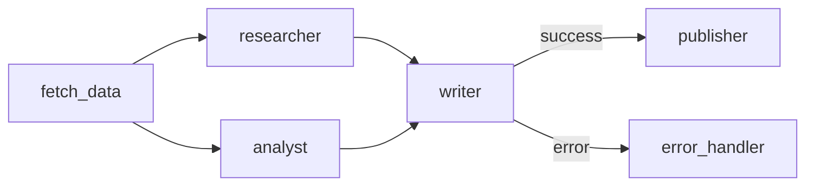

# Vessy — Core Engine & Plugin SDK Design

**Date:** 2026-06-24  
**Scope:** Spec 1 of N — `@vessy/core` + `@vessy/sdk` + adapter interface  
**Status:** Approved

---

## Overview

Vessy is an agentic pipeline orchestrator that executes pipelines defined as Mermaid flowcharts. Each node in the graph is an agent; edges define execution order and conditional routing. Pipeline runs produce versioned artifacts in a session folder.

This spec covers:
- Monorepo structure
- Agent definition format
- Pipeline definition format
- Core execution engine internals
- Plugin SDK interface (slash commands contract)
- Session and artifact management
- Error handling
- Testing strategy

Adapter implementations (Claude Code, Copilot, Opencode) are covered in Spec 2+.

---

## 1. Monorepo Structure

```
vessy/
├── packages/
│   ├── core/                  # @vessy/core — platform-agnostic engine
│   ├── sdk/                   # @vessy/sdk — plugin interface + shared types
│   ├── adapter-claude-code/   # @vessy/adapter-claude-code
│   ├── adapter-copilot/       # @vessy/adapter-copilot
│   └── adapter-opencode/      # @vessy/adapter-opencode
├── pnpm-workspace.yaml
└── turbo.json
```

**`@vessy/core`** contains all execution logic: Mermaid parser, agent loader, pipeline executor, artifact manager. It has no knowledge of any host platform.

**`@vessy/sdk`** exports TypeScript interfaces and types only — no logic. Every adapter implements these interfaces to expose slash commands to its host.

**Adapters** depend on both `@vessy/core` and `@vessy/sdk`. They are thin translation layers: they receive a slash command from the platform, call the core engine, and render the result in the platform's native format.

---

## 2. Agent Definition Format

Agents live in `.vessy/agents/<name>.yaml`. The filename (without extension) must match the node name used in Mermaid pipeline diagrams.

```yaml
name: researcher
type: llm           # llm | script | composite

# Required for type: llm
model: claude-opus-4-7   # any supported model identifier
system_prompt: |
  You are a research specialist. You receive predecessor artifact paths
  as environment variables and write your outputs to your session subfolder.
tools:
  - web_search
  - read_file

# Required for type: script
# script: ./scripts/researcher.py
# args: ["--verbose"]

# Optional
timeout: 120   # seconds; treated as error if exceeded
```

**Agent types:**

| Type | Behavior |
|---|---|
| `llm` | Direct API call to the specified model via Anthropic SDK, OpenAI SDK, etc. |
| `script` | Runs an external script as a subprocess; communicates via stdin/stdout and env vars |
| `composite` | Ordered sequence of internal steps defined as an inline `steps` list in the agent YAML (each step is itself an `llm` or `script` entry); avoids creating a full pipeline for simple multi-step agents |

The default agents directory is `.vessy/agents/`. It can be overridden in `.vessy/config.yaml`.

---

## 3. Pipeline Definition Format

Pipelines live in `.vessy/pipelines/<name>.md` — a Markdown file with YAML frontmatter and a Mermaid flowchart block.

```markdown
---
name: research-and-write
description: Researches a topic and produces a published article
---


```

**Execution mapping rules:**

- A node with no incoming edges is a start node and runs immediately.
- Multiple nodes at the same dependency level run in parallel via `Promise.all`.
- Unlabeled edges mean unconditional sequencing.
- Labeled edges (`|success|`, `|error|`) are conditional: the executor reads the `status` field from the predecessor's `manifest.json` to determine which outgoing edge to follow.

**Output manifest:** every agent writes a `manifest.json` to its session subfolder upon completion. This is the only structurally required file:

```json
{
  "status": "success",
  "outputs": ["report.md", "data.json"]
}
```

All other files in the subfolder are free-form artifacts of any type.

---

## 4. Core Execution Engine (`@vessy/core`)

Four components with a single responsibility each:

### AgentLoader

Reads and validates `.vessy/agents/*.yaml` files. Returns typed `AgentDefinition` objects. Fails fast if an agent referenced in a pipeline does not have a corresponding file.

### PipelineParser

Reads `.vessy/pipelines/<name>.md`, extracts the Mermaid block, and parses it into a DAG (Directed Acyclic Graph) of nodes, edges, and conditional labels. Validates that every node has a corresponding agent definition before execution begins.

### PipelineExecutor

Traverses and executes the DAG:

1. Identify ready nodes (those whose predecessors have all completed).
2. Execute ready nodes in parallel via `Promise.all`.
3. On completion of each node, read its `manifest.json` to resolve conditional edges.
4. Repeat until all nodes complete or a node fails without an error handler.

### ArtifactManager

Creates and manages the session folder structure for each pipeline run.

---

## 5. Session and Artifact Management

Each pipeline run creates a **master session** with a human-readable UUID:

```
.vessy/sessions/
  session-a3f7bc92/              ← master session (stable for the entire run)
    pipeline-run.json            ← run metadata: pipeline name, start time, status
    01-fetch_data/               ← incremental number + agent name
      manifest.json
      raw_data.json
    02-researcher/               ← parallel with 03, numbered by start order
      manifest.json
      report.md
    03-analyst/
      manifest.json
      analysis.json
    04-writer/
      manifest.json
      article.md
    05-publisher/
      manifest.json
      published-url.txt
```

**Rules:**

- The master session UUID is generated once at run start and remains stable.
- Each agent invocation receives a zero-padded incremental number based on start order. Parallel agents receive consecutive numbers in alphabetical order (deterministic).
- Subfolder names follow the pattern `<NNN>-<agent-name>` (zero-padded to the width needed for the total node count) to preserve visual sort order.
- Subfolder contents are completely free — any file type is valid.
- `pipeline-run.json` is updated in real-time and maps agent names to their subfolder paths.

Each agent receives the paths to its own output folder and its predecessors' output folders as environment variables:

- `VESSY_SESSION_DIR` — absolute path to the master session folder
- `VESSY_OUTPUT_DIR` — absolute path to this agent's own output subfolder
- `VESSY_INPUT_<AGENT_NAME>` — absolute path to each direct predecessor's subfolder (one var per predecessor, uppercased agent name)

**`pipeline-run.json` structure:**

```json
{
  "pipeline": "research-and-write",
  "sessionId": "session-a3f7bc92",
  "startedAt": "2026-06-24T10:00:00Z",
  "status": "running",
  "agents": {
    "fetch_data": { "folder": "01-fetch_data", "status": "completed" },
    "researcher": { "folder": "02-researcher", "status": "running" }
  }
}
```

---

## 6. Plugin SDK (`@vessy/sdk`)

`@vessy/sdk` defines the contract every adapter must implement. No logic — types and interfaces only.

### VessyAdapter interface

```typescript
interface VessyAdapter {
  listAgents(): Promise<AgentSummary[]>
  addAgent(definition: AgentDefinition): Promise<void>
  listPipelines(): Promise<PipelineSummary[]>
  getPipelineDiagram(name: string): Promise<string>
  runPipeline(name: string, opts?: RunOptions): AsyncIterable<RunEvent>
}
```

### Slash command mapping

| Slash command | Method |
|---|---|
| `/vessy:agents` | `listAgents()` |
| `/vessy:add-agent` | `addAgent(...)` |
| `/vessy:agent-pipelines` | `listPipelines()` |
| `/vessy:agent-pipelines <name>` | `getPipelineDiagram(name)` |
| `/vessy:run-pipeline <name>` | `runPipeline(name)` |

### RunEvent union type

Adapters stream progress to the host platform via `AsyncIterable<RunEvent>`:

```typescript
type RunEvent =
  | { type: 'agent:start';    agent: string; folder: string; session: string }
  | { type: 'agent:complete'; agent: string; artifacts: string[] }
  | { type: 'agent:error';    agent: string; error: string }
  | { type: 'pipeline:done';  sessionDir: string }
```

Each adapter translates these events into the platform's native output format (text output, notifications, etc.).

---

## 7. Error Handling

The `PipelineExecutor` follows a **fail-fast with optional recovery** policy:

- If an agent fails and the DAG has an outgoing `|error|` edge to an error handler node, execution continues on that branch.
- If an agent fails with no error handler, the pipeline stops immediately. The session folder remains on disk for inspection.
- `pipeline-run.json` is written in real-time; an interrupted run is always inspectable.
- An agent that exceeds its `timeout` is treated as an error with status `timeout_exceeded`.

---

## 8. Testing Strategy

**`@vessy/core`:**
- Unit tests on `AgentLoader` (valid/invalid YAML, missing agents), `PipelineParser` (DAG correctness from various Mermaid inputs, conditional edges), `ArtifactManager` (folder creation, manifest reading).
- Integration tests on complete pipelines using mock `script`-type agents (minimal shell scripts that write a `manifest.json`).

**`@vessy/sdk`:**
- Type-level tests only; no runtime logic to test.

**Adapters:**
- Smoke tests: each slash command responds without crashing against an empty agents/pipelines folder.

**Framework:** Vitest (native TypeScript, fast, consistent with the ecosystem).

---

## Out of Scope (this spec)

- Adapter implementations (Claude Code, Copilot, Opencode) — Spec 2+
- Authentication / API key management for LLM providers
- Pipeline versioning or rollback
- Remote execution or distributed agents
