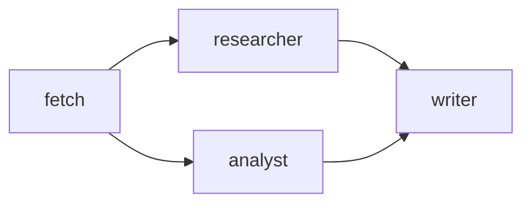

# Vessy — Claude Code Adapter Design

**Date:** 2026-06-25
**Scope:** Spec 2a — `@vessy/adapter-claude-code`
**Status:** Approved

---

## Overview

`@vessy/adapter-claude-code` is a Claude Code plugin that exposes vessy's pipeline orchestration capabilities as slash commands. It follows the same plugin/skill model used by superpowers: skill markdown files guide Claude's behavior, and a bundled CLI executes the actual work.

The adapter is **fully autonomous**: a single `dist/cli.js` bundle (produced by esbuild) includes `@vessy/core` and all dependencies. No project-level installation required — install the plugin once, use it in any project that has a `.vessy/` directory.

---

## 1. Package Structure

```
packages/adapter-claude-code/
├── package.json          # @vessy/adapter-claude-code
├── tsconfig.json         # extends ../../tsconfig.base.json
├── build.ts              # esbuild script: src/cli.ts → dist/cli.js
├── plugin.json           # Claude Code plugin manifest
├── src/
│   ├── cli.ts            # Entry point: parses argv, dispatches to command
│   ├── commands/
│   │   ├── agents.ts     # list-agents → listAgents() → formatted text
│   │   ├── run.ts        # run-pipeline → runPipeline() → formatted events
│   │   ├── pipelines.ts  # list-pipelines → listPipelines() → formatted text
│   │   └── diagram.ts    # diagram <name> → getPipelineDiagram() → Mermaid block
│   └── format.ts         # RunEvent → text lines for Claude Code output
└── skills/
    ├── vessy-agents.md
    ├── vessy-run-pipeline.md
    ├── vessy-add-agent.md
    └── vessy-agent-pipelines.md   # handles both list and diagram (with/without arg)
```

`add-agent` has no CLI command — its skill instructs Claude to gather agent details conversationally and write the YAML file directly using the Write tool.

---

## 2. Build

`build.ts` uses esbuild to produce a single CommonJS bundle:

```typescript
import { build } from 'esbuild'

await build({
  entryPoints: ['src/cli.ts'],
  bundle: true,
  platform: 'node',
  target: 'node20',
  format: 'cjs',
  outfile: 'dist/cli.js',
  external: [],   // bundle everything including @vessy/core
})
```

The output `dist/cli.js` is self-contained and requires only Node.js 20+ to run.

---

## 3. CLI Commands

The CLI is invoked as `node dist/cli.js <command> [args]` with `process.cwd()` as the working directory, so it automatically resolves `.vessy/agents/`, `.vessy/pipelines/`, and `.vessy/sessions/` from the project root.

| Command | Calls | Output |
|---|---|---|
| `agents` | `listAgents()` | Formatted agent table |
| `pipelines` | `listPipelines()` | Formatted pipeline table |
| `diagram <name>` | `getPipelineDiagram(name)` | Raw Mermaid block |
| `run <name>` | `runPipeline(name)` | Streaming event lines |

### Exit codes

- `0` — success, including pipeline-level failures (Failed status is business logic)
- `1` — technical error: pipeline file not found, agent file missing, parse error

### Output format — `run <name>`

Events are printed to stdout as they arrive:

```
▶  fetch          session-a3f7bc92 / 1-fetch
✓  fetch          Passed     4.2s
▶  researcher     session-a3f7bc92 / 2-researcher
▶  analyst        session-a3f7bc92 / 3-analyst
✓  researcher     Passed     8.1s    1540 tok  $0.012
✓  analyst        Passed     7.4s    2100 tok  $0.018
▶  writer         session-a3f7bc92 / 4-writer
✗  writer         Failed     Script exited with code 1
─────────────────────────────────────────────────────
Pipeline        Failed     32.0s   $0.030
Session         .vessy/sessions/session-a3f7bc92
```

### Output format — `agents`

```
researcher    llm     claude-opus-4-7
analyst       llm     claude-haiku-4-5
runner        script
```

### Output format — `diagram <name>`

The Mermaid source is printed verbatim inside a fenced code block so Claude Code renders it as a diagram:

````

````

---

## 4. `format.ts`

A pure module that maps each `RunEvent` type to a formatted text line. No I/O — takes an event, returns a string. Kept separate for testability.

```typescript
export function formatEvent(event: RunEvent): string
export function formatDone(report: PipelineReport, sessionDir: string): string
```

---

## 5. Plugin Manifest (`plugin.json`)

```json
{
  "name": "vessy",
  "version": "0.1.0",
  "description": "Agentic pipeline orchestrator for Claude Code",
  "skills": [
    { "name": "vessy-run-pipeline",     "command": "vessy:run-pipeline" },
    { "name": "vessy-agents",           "command": "vessy:agents" },
    { "name": "vessy-agent-pipelines",  "command": "vessy:agent-pipelines" },
    { "name": "vessy-add-agent",        "command": "vessy:add-agent" }
  ]
}
```

---

## 6. Skills

Each skill file is a markdown document. The CLI is referenced as `../dist/cli.js` relative to the skill file's directory (skills live in `skills/`, CLI lives in `dist/`).

### `/vessy:run-pipeline <name>`
Instructions: extract the pipeline name from the slash command arguments. Run `node ../dist/cli.js run <name>` via Bash. Present the output, highlighting the final status and session path.

### `/vessy:agents`
Instructions: run `node ../dist/cli.js agents` via Bash. Present the result as a formatted table.

### `/vessy:agent-pipelines [name]`
Single skill that handles both cases. Instructions: if no argument is provided, run `node ../dist/cli.js pipelines` via Bash and present name and description for each pipeline. If a pipeline name is provided, run `node ../dist/cli.js diagram <name>` via Bash and render the returned Mermaid block.

### `/vessy:add-agent`
Instructions: ask the user conversationally — name, type (`llm` / `script` / `composite`), then type-specific fields (`model` + `system_prompt` for llm, `script` for script). Write the resulting YAML to `.vessy/agents/<name>.yaml` using the Write tool. Confirm the created path.

---

## 7. Testing

### CLI unit tests (Vitest)

| File | What it tests |
|---|---|
| `format.test.ts` | Each `RunEvent` type → expected formatted line |
| `agents.test.ts` | Mock `AgentLoader`, verify tabular output |
| `run.test.ts` | Mock `runPipeline` with fixture events, verify stdout lines |
| `pipelines.test.ts` | Mock `listPipelines`, verify output |
| `diagram.test.ts` | Verify Mermaid block printed verbatim |

### Smoke test (Bash)

Builds the CLI and runs each command against an empty `.vessy/` directory. Verifies exit code `0` and no crash for `agents`, `pipelines`. Verifies exit code `1` for `run nonexistent`.

### Skill files

No automated tests — correctness verified by using the skills in Claude Code.

---

## 8. Out of Scope (this spec)

- Copilot and Opencode adapters — Spec 2b, 2c
- Plugin publishing / `claude plugin install` workflow
- Interactive pipeline editor or agent YAML wizard beyond simple prompting
- LLM cost calculation (inherited limitation from `@vessy/core`)
