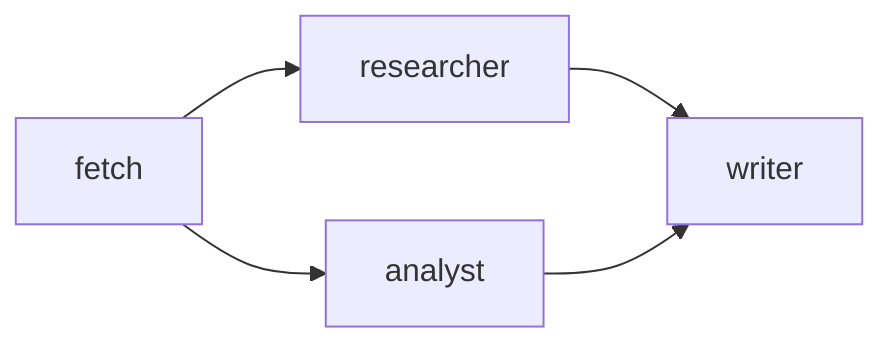

# `/vessy:agent-pipelines [name]`

Lists all pipelines in the current project, or shows the Mermaid diagram for a specific pipeline.

## Instructions

Determine the vessy plugin directory (the parent of the `skills/` directory containing this file).

### If no argument is provided — list pipelines

Use the Bash tool to run:
```bash
node <vessy-plugin-dir>/dist/cli.cjs pipelines
```

Present each pipeline's name and description. If the directory is empty, report that no pipelines are configured.

### If a pipeline name is provided — show diagram

Use the Bash tool to run:
```bash
node <vessy-plugin-dir>/dist/cli.cjs diagram <name>
```

The output is a fenced Mermaid code block. Render it as a diagram. Describe the pipeline's flow in one sentence after the diagram.

## Example — list

```
etl                   Extract and process data
analyze
```

## Example — diagram


